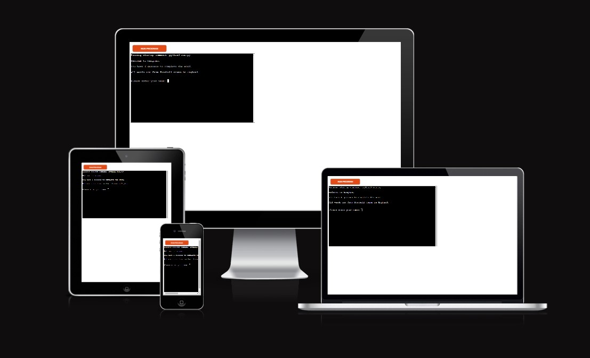
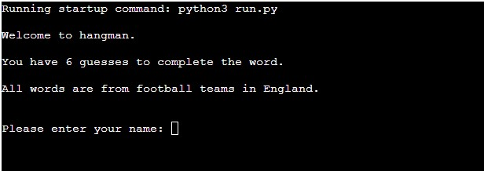
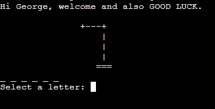
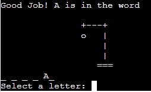
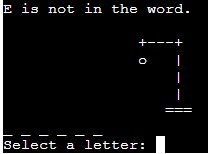
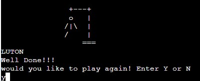
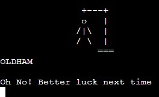
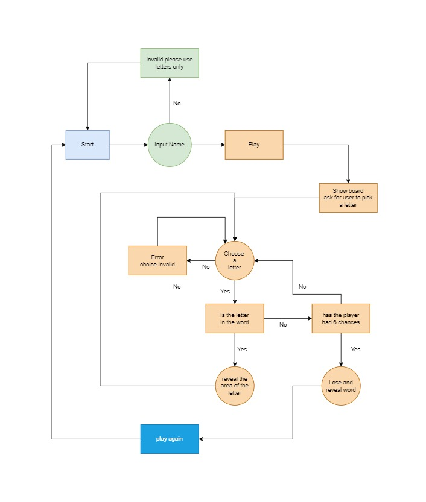
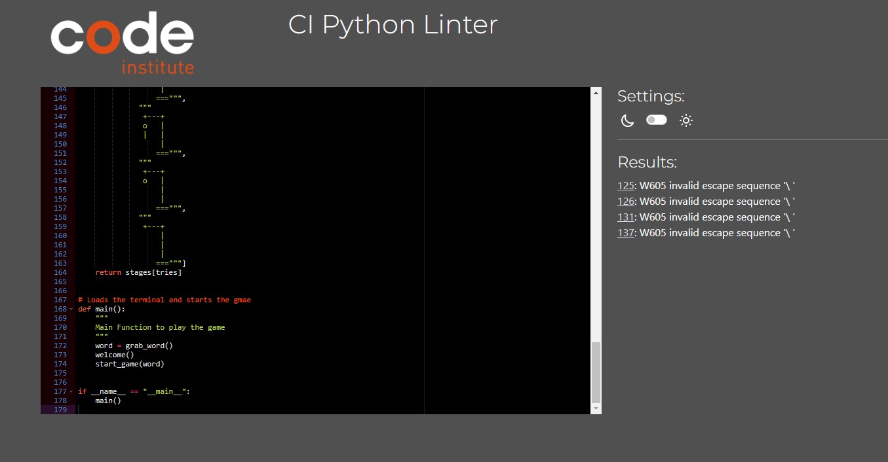

# **Hangman Game**

This hangman game was written in Python and played on a terminal based window.

This game of hangman is based around football teams in the UK. It is a standard based hangman game, meaning you have six lives to get the word correct.
The word has been randomised from the words.py file

## **Table of Contents**

- [How to Play](#how-to-play)
- [Features](#features)
    - [Existing Features](#existing-features)
    - [Future Features](#future-features)
    - [Flowchart](#flow-chart)
- [Testing](#testing)
    - [Bugs](#bugs)
    - [Validator Testing](#vaidation)
- [Deployment](#deployment)
- [Credit](#credit)

## **How to Play**

* You must try to guess a given word one letter at a time.
* The letters in the word will be replaced with a "_ " underscore, so you will have to fill them in.
* You have 6 guesses in which if you do not get the word by then, you lose.
* If you get a letter right, you will see it appear in the space of which it is in the word.
* Once you come to the end of the game you will be asked if you want to play again. 

## **Features**

### Existing Features

The welcome message below shows the rules and asks the player to input their name to make it unique to them.

Once the player has input their name, they will be asked to select a letter. 
They will also be shown how many letters the word has.

If the player gets a letter correct, it will show the player where on the word there letter is.

If the player gets a letter wrong, then the hangman image will update to show they have lost a life.

When the player gets all the letters correct, it will show a message and the word will be revealed.
It will also ask if they want to play again.

When the player runs out of tries, it will appear this message and will also reveal the word. 
It will also ask if they want to play again.

### Future Features

* Create a website by including HTML and CSS
* Have levels like easy, medium and hard. Include football teams around the world.
* Add an option to guess the word.
* Have a scoreboard.

### Flow Chart
Below is a flowchart of the game. This is the initial idea for what I want the game to have.

## **Testing**

I have manually tested this project by doing the following:
- Tested in my local terminal and the Code Institute Heroku terminal.
- Passed the code through a PEP8 linter and confirmed there are no problems.
- Tested there is a message for all possiblities and outcomes.

### Bugs

**Solved Bugs**

    - I had used isalpha() to make people use letters only.
    - If the player gets the word correct, they would still have to keep going until they run out of tries and then be told they lost. 
    I had fixed this by adding an if statement and telling it if it got the letter correct and there is no more words to guess, then change guessed to True.

**Unfixed Bugs**

    - there is no bugs remaining

### Validator Testing

## **Deployment**

- Fork or clone this repository
- Create a new Heroku app
- Go to settings and add a config var with key = PORT and value = 8000
- Set the buildbacks to Python and NodeJS. In that order.
- Go to Deploy and link the Heroku app to the repository
- Click Deploy

## **Credit**

- I used websites like Google, Stack Overflow and W3Schools to complete my project.
- [isalpha() method](https://www.w3schools.com/python/ref_string_isalpha.asp)
- [Hangman Display](https://inventwithpython.com/invent4thed/chapter8.html)